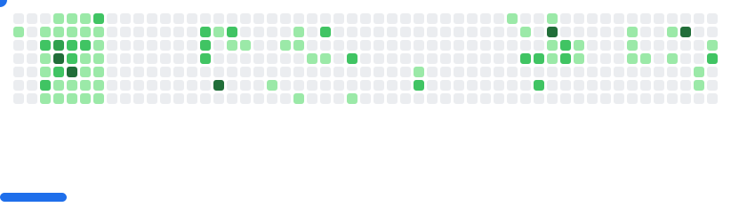

I'm currently studying <strong>Computer Science Engineering</strong> at <strong>SJCET, Palai</strong>. I am working on some side projects 💡, learning a couple new dishes 🍳, and trying to conquer the world 🌍🚀.

- 🌱 Currently learning: Java and PHP
- 💻 Exploring: Web Development and Artificial Intelligence
- 💬 I’m a hands-on learner who loves building, breaking, and rebuilding until it clicks.

### 👨‍💻 Languages  

### 🧰 Tools & Frameworks  

### 🎨 Design & Misc Tools  

 
## 🌐 Socials

## 📈 GitHub Stats

  
## 💰 You can help me by Donating
 
 

---

*Feel free to explore my repositories and reach out if you'd like to collaborate!* 😊
*Thanks for visiting my profile!* 🙌

<picture>
  <source
    media="(prefers-color-scheme: dark)"
    srcset="images/breakout-dark.svg"
  />
  <source
    media="(prefers-color-scheme: light)"
    srcset="images/breakout-light.svg"
  />
  
</picture>
